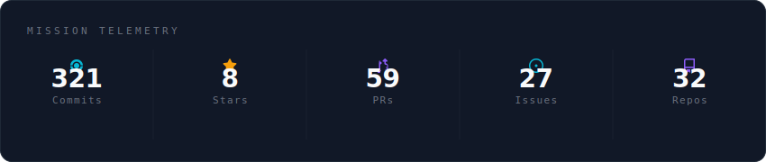

<!-- Galaxy Profile README Template
     Customize this file with your own info, then rename it to README.md
     in your GitHub profile repo (github.com/YOUR_USERNAME/YOUR_USERNAME).
     The SVG paths below point to assets/generated/ which are auto-generated
     by the GitHub Actions workflow or by running: python -m generator.main -->

  

 

  

 

  

 

  

 

<strong>More about me</strong>

 

Building software and collecting stories.

I am a Back-end Developer specialized in the Java ecosystem (Spring Boot), focused on modernizing and building scalable systems that directly impact the lives of thousands of users.

Currently at SergipeTec (SEFAZ-SE), I am one of the developers responsible for delivering robust solutions that benefit over 50,000 taxpayers, with a strong focus on high-performance REST APIs, secure system integrations, and clean development practices.

Professional experience with: Java, Spring Boot, Spring Security, JPA/Hibernate, Maven, Gradle, REST APIs, Microservices, Docker, AWS (EC2, S3), CI/CD (GitHub Actions), PostgreSQL, MySQL, RabbitMQ, Linux, and Agile methodologies (Scrum/Kanban).

 

  
  

